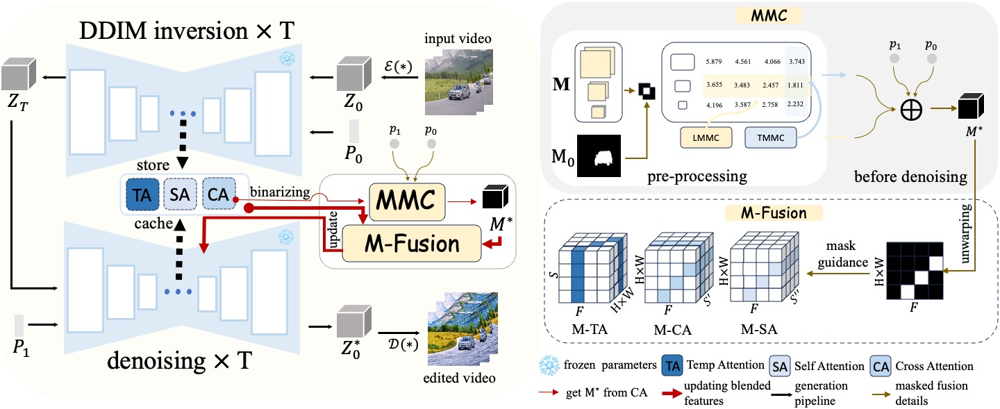

<div align="center">
<h1> FreeMask: Rethinking the Importance of Attention Masks for Zero-shot Video Editing
</h1>




> Abstract:
> Text-to-video diffusion models have made remarkable advancements. Driven by their ability to generate temporally coherent videos, research on zero-shot video editing using these fundamental models has expanded rapidly.
> To enhance editing quality, structural controls are frequently employed in video editing. Among these techniques, cross-attention mask control stands out for its effectiveness and efficiency.
> However, when cross-attention masks are naively applied to video editing, they can introduce artifacts such as blurring and flickering.
> Our experiments uncover a critical factor overlooked in previous video editing research: cross-attention masks are not consistently clear but vary with model structure and denoising timestep. 
> To address this issue, we propose the metric Mask Matching Cost (MMC) that quantifies this variability and propose \textbf{FreeMask}, a method for selecting optimal masks tailored to specific video editing tasks.
> Using MMC-selected masks, we further improve the masked fusion mechanism within comprehensive attention features, e.g., temp, cross, and self-attention modules.
> Our approach can be seamlessly integrated into existing zero-shot video editing frameworks with better performance, requiring no control assistance or parameter fine-tuning but enabling adaptive decoupling of unedited semantic layouts with mask precision control. 
> Extensive experiments demonstrate that FreeMask achieves superior semantic fidelity, temporal consistency, and editing quality compared to state-of-the-art methods.


## Updates

* [x] 2025.1.16 Code Version 1 released (on base model Zeroscope, editing tasks including stylization & shape editing) 

* [x] 🎉 2024.12.9 Accepted by AAAI2025！

* [x] Code will be made publicly available after meticulous internal review. Stay tuned ⭐ for updates!

## Citation

```bibtex
@inproceedings{cai2025freemask,
   title={FreeMask: Rethinking the Importance of Attention Masks for Zero-shot Video Editing},
   author={Cai, Lingling and Zhao, Kang and Yuan, Hangjie and Zhang, Yingya and Zhang, Shiwei and Huang, Kejie},
   booktitle={Proceedings of the Thirty-Ninth Conference on Association for the Advancement of Artificial Intelligence (AAAI-25)},year={2025}}
```


## Quick Start

#### 1. Environment Requirements

```bash
conda create -n freemask python==3.11
conda activate freemask
pip install -r requirements.txt
```

#### 2. MMC metrics calculation

##### 2.1 prepare a video dataset with pre-computed segmentations (take DAVIS 2016 for example)

download DAVIS2016: https://davischallenge.org/davis2016/code.html
In DAVIS2016,  videos with only a single category segmentation map are selected, and 8 frames are chosen from each video for computation.

##### 2.2 cross-attention maps visualization

Prepare configs for all of your selected videos like this:

```
config/mask_bear.yaml
```

you need to change these settings for different videos:

```yaml
dataset_config:
    path: "dataset/frames/bear" #change to your video frame path
    prompt: "a bear is walking" #change to your prompt
...
editing_config:
    cal_maps: True #True for cross-attention visualization
    dataname: "bear" #change to your video name
    word: ["bear","bear"] #change to your edited object 
    ...
    editing_prompts: [
        a bear is walking
    ] #change to your prompt
```

Run for cross-attention visualization

```bash
python cal_mask.py --config config/mask_bear.yaml
```

Then, cross-attention maps towards `dataname` across all layers and all timesteps will be saved at `./camap/dataname`

##### 2.3 calculation

calculate the MIoU of all cross-attention maps with the ground-truth segmentation mask, then get the TMMC and LMMC according the the Eq.2-6 in the paper.

we provide an exmaple for MIoU calculation for one cross-attention map with the ground-truth segmentation mask:

```bash
python calculate_miou.py "dataset/miou_test/bear_mask.jpg" "dataset/miou_test/binarized_bear_camap.jpg"
```

After calculating the average MMC of all videos, you will get a codebook about MMC across timesteps and layers.

#### 3. Editing for different tasks

##### 3.1 style translation

prepare a configs like:

```bash
config/giraffe_style.yaml
```

Run for style translation:

```bash
python run.py --config config/giraffe_style.yaml
```

##### 3.2 shape editing

prepare a configs like:

```
config/girl_jump_shape.yaml
```

Run for shape editing:

```bash
python run.py --config config/girl_jump_shape.yaml
```

